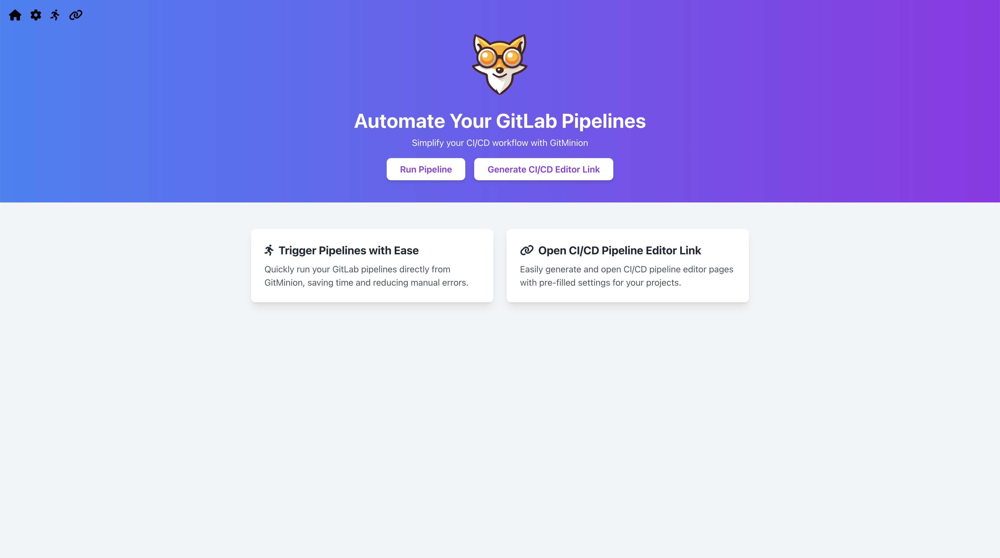
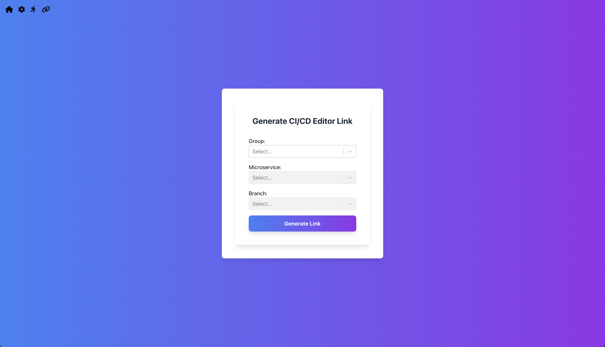

<div align="center">
   <h1> GitMinion</h1>
    
        <p>GitMinion simplifies the CI/CD workflow by providing a user-friendly interface to trigger GitLab pipelines and manage pipeline configurations.</p>
</div>

## ⭐ Features

- **Trigger GitLab Pipelines**: Easily trigger pipelines for your GitLab projects directly from the interface.
- **Pipeline Configuration**: Generate and open CI/CD pipeline editor pages with pre-filled settings for convenience.
- **Environment Variables**: Configure and include custom environment variables when triggering pipelines.

## 🔧 How to Install

### 🐳 Docker

```bash
docker run -d --restart=always -p 3000:80 --name gitminion osamayusuf/gitminion:1
```

GitMinion is now running on [http://localhost:3000](http://localhost:3000).

### 💪🏻 Non-Docker

```bash
# Clone the repository
git clone https://github.com/Osama-Yusuf/GitMinion.git
cd GitMinion

# Install the dependencies
npm install

# Start the development server
npm start
```

GitMinion is now be running on [http://localhost:3000](http://localhost:3000).

## Usage

1. **Configure Settings**: Navigate to the settings page via the gear icon to enter your GitLab link and personal access token.
2. **Run Page**: Use the Run page to trigger pipelines with optional environment variables.
3. **Link Page**: Generate and open the CI/CD pipeline editor page from the Link page by providing the required project details.

## 🖼 Screenshots

### Home Page



### Trigger Pipeline Page


### Generate CI/CD Editor Link Page



## Contributing

Contributions are welcome, and any help that can improve the project is appreciated. Here’s how you can contribute:

1. Fork the repository.
2. Create your feature branch (`git checkout -b feature/AmazingFeature`).
3. Commit your changes (`git commit -am 'Add some AmazingFeature'`).
4. Push to the branch (`git push origin feature/AmazingFeature`).
5. Open a pull request.

## License

Distributed under the MIT License. See `LICENSE` for more information.

## Contact

osama9mohamed5@gmail.com
[https://github.com/osama-yusuf/GitMinion](https://github.com/osama-yusuf/GitMinion)
